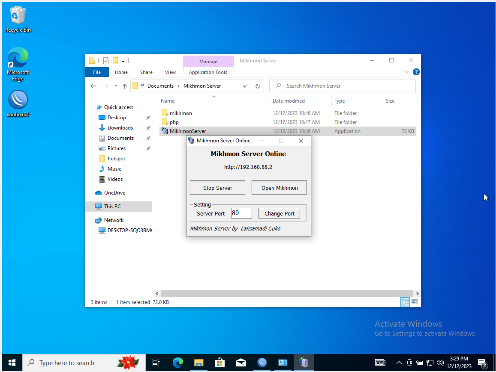
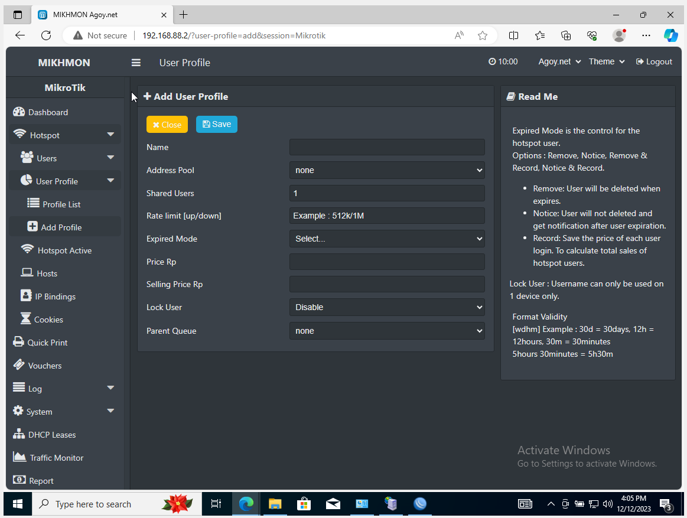

<h1 align="center">PERANCANGAN JARINGAN HOTSPOT VOUCHER DENGAN MIKROTIK MENGGUNAKAN MIKHMON PADA KANTIN SEKOLAH</h1>

## Kelompok 3 :
- Dina Amilia		21050974008
- Arju Kurnia		21050974029
- Awwalia Arofatun 	21050974030
- Yusi Eka Sonia F.	21050974040
- Yoga Putra R.		21050974043

## Deskripsi : 
<h1 align=center"> Mikhmon sebagai solusi yang efektif, diperkenalkan dengan sistem voucher untuk menyederhanakan tugas manajemen hotspot. yang mencakup pengontrolan akses internet secara terpusat dan penghitungan kuota akses. Tujuan dari implementasi Mikhmon adalah memberikan kenyamanan kepada pengguna dan meningkatkan efisiensi kontrol internet bagi penyedia layanan. Dengan demikian, Mikhmon menjadi solusi yang efektif untuk mengatasi tantangan dalam manajemen hotspot berbayar, menciptakan lingkungan internet yang stabil dan terkelola dengan baik.

## Fitur :
- pengontrol pengguanaan akses internet terpusat
- penghitungan kuota akses
- menghentikan akses otomatis

## Tools
Sistem ini dibangun menggunakan : 
- Laptop 
- Oracle VM Virtual Box
- Guest OS Mikrotik
- Guest OS Windows
- Mikhmon server

## Langkah-langkah : 
### Bahan :
   - Oracle VM Virtual Box : [Virtual Box](https://www.virtualbox.org/wiki/Downloads)
   - Mikrotik OS : [Mikrotik OS](https://mikrotik.com/download)
   - Windows OS : [Windows 10](https://www.microsoft.com/en-us/software-download/windows10)
   - Mikhmon Server : [Mikhmon](https://laksa19.github.io/?mikhmon/v3)
### VM OVA
   - Router Mikrotik : 
   - Windows 10 CLient : 
     
### Tahap Konfigurasi Penyimpanan Awan
Pada tahapan konfigurasi virtual machine kami menggunakan guest os mikrotik sebagai router dan windows 10 sebagai client yang berjalan pada oracle virtual box.

  #### A. Konfigurasi Router Mikrotik 
   1. Instal terlebih dahulu Mikrotik OS pada virtual machine.
      
   2. Selanjutnya masuk ke mikrotik dengan User : admin, Password : admin. 
      
   3. Lakukan konfigurasi network pada Guest OS Mikrotik. Pada Adapter 1 pilih Host-Only Adapter. Pada Adapter 2 pilih Internal network.
      
      
  #### B. Konfigurasi Komputer Client Windows 10 
   1. Instal terlebih dahulu OS Windows 10 pada virtual machine. 
      
   2. Lakukan konfigurasi network pada Guest OS Windows 10. Pada Adapter 1 pilih Internal Network.
      

### Tahap Konfigurasi Hotspot Mikrotik
Pada tahapan ini akan dilakukan konfigurasi hotspot di mikrotik melalui winbox.

  #### A. Konfigurasi Internet Sharing Pada Komputer 
   1. Buka Control Panel pada komputer, lalu buka Network Connections. 
      
   2. Klik kanan pada Wi-Fi, lalu buka properties.
      
   3. Kemudian masuk pada menu sharing, lakukan sharing dengan centang allow lalu arahkan pada VirtualBox Host-Only Network.
      
   4. Kemudian masuk pada menu VirtualBox Host-Only Network untuk mengetahui ip addressnya.
      
  #### B. Konfigurasi Internet Router Mikrotik melalui Winbox
   1. Buka Winbox kemudian masuk ke router mikrotik menggunakan alamat mac address, masuk menggunakan User : admin dan Password : admin.
      
   2. Masuk pada menu interfaces, kemudian ubah nama interface pada ether1 menjadi LAN, ether2 menjadi inet.
      
   3. Masuk pada menu IP lalu Addresses, lalu tambahkan alamat IP 192.168.137.100/24 pada ether2-inet sebagai jalur internet. Tambahkan juga alamat IP 192.168.88.1/24 pada ether1-LAN sebagai jalur hotspot.
      
   4. Masuk ke menu Firewall lalu NAT, tambahkan NAT pada out interface ether2-inet dengan action masquarade agar mikrotik mendapatkan internet.
      
   5.  Selanjutnya masuk pada menu terminal yang ada di mikrotik, lakukan ping google.com untuk mengetahui apakah router sudah mendapatkan koneksi internet.
      
  #### C. Konfigurasi Internet Pada Komputer Client
   1. Buka Control Panel pada komputer, lalu buka Network Connections. 
      
   2. Klik kanan pada Ethernet, lalu buka properties.
      
   3. Masukkan alamat IP pada Ipv4 dengan IP 192.168.88.2/24, dan subnet 192.168.137.1
      
   4. Buka terminal pada komputer client, lalu lakukan ping google.com agar mengetahui komputer terhubung dengan internet.
      
  #### D. Konfigurasi Hotspot Router Mikrotik
   1. Masuk pada menu IP lalu Hotspot, pada menu servers lalu hotspot setup tambahkan hotspot interface pada ether1-LAN, lalu klik next, tambahkan pada dns name agoy.net lalu next.
      
      
   2. Kemudian buka browser, lalu ketikkan dns name yang sudah kita buat tadi, lalu masukkan user dan password yang telah kita buat.
      
   3. Kemudian buka tab baru ketikkan google.com untuk mengetahui komputer sudah terhubung ke internet.
      
  #### E. Konfigurasi Mikhmon Server 
   1. Buka Aplikasi Mikhmon server yang telah didownload. Kemudian klik start.
      
   2. Klik Open Mikhmon, kemudian akan diarahkan pada browser. Masukkan user : mikhmon dan password : 1234.
      
   3. Setelah Masuk maka akan dialihkan ke beranda mikhmon.
      
   4. Masuk pada menu Router, tambahkan alamat IP Router Mikrotik dan Akun yang didaftar pada Router Mikrotik. Tambahkan juga Hotspot Name dengan Agoy.Net dan untuk dns name yang telah kita setting pada mikrotik agoy.net. Jika sudah lakukan save.
      
   5. Setelah melakukan terhubung dengan router mikrotik, maka akan diarahkan ke halaman dashboard router kita.
      
  #### F. Konfigurasi Voucher
   1. Masuk pada menu hotspot yang ada disebelah kiri, lalu masuk pada user profile.
      
   2. Buat user profile baru dengan klik tombol add, maka akan dialihkan pada halaman add user profile.
      
   3. Contoh disini akan dibuat user profile dengan nama menit, limit kecepatan 512k, durasi 30 menit, dengan harga 5000. Jika sudah klik save.
      
   4. Buka kembali menu Profile List untuk melihat apakah user profile sudah tertambahkan.
      
   5. Buka Dashboard kembali lalu pilih Generate untuk membuat voucher.
      
   6. Contoh disini akan digenerate voucher sejumlah 5, username=password dengan panjang huruf 4. Jika sudah klik generate.
      
   7. Selanjutnya klik Print untuk melihat voucher yang sudah digenerate.
      

### Tahap Pengujian
Pada tahapan ini akan dilakukan pengujian koneksi pada voucher yang sudah dibuat. 
   1. Buka browser lalu ketikkan agoy.net pada browser.
      
   2. Masukkan kode voucher yang sudah dibuat dalam halaman login voucher. Jika sudah klik OK.
      
   3. Maka akan muncul status dari voucher yang sudah dimasukkan.
      
   4. Selanjutnya buka tab baru ketikkan google.com untuk mengetahui komputer sudah terhubung ke internet. 
      
   5. Buka tab baru ketikkan speedtest untuk mengetahui kecepatan internet yang sudah kita setting.
      

## Kesimpulan

##### Sistem ini disusun oleh :
 > Yoga Putra R. 043 | 
 > Arju Kurnia 029 |
 > Dina Amilia	008 |
 > Awwalia Arofatun 030 |
 > Yusi Eka Sonia F. 040
##### 🌐[S1 Pendidikan Teknologi Informasi UNESA](https://pendidikan-ti.ft.unesa.ac.id/)

